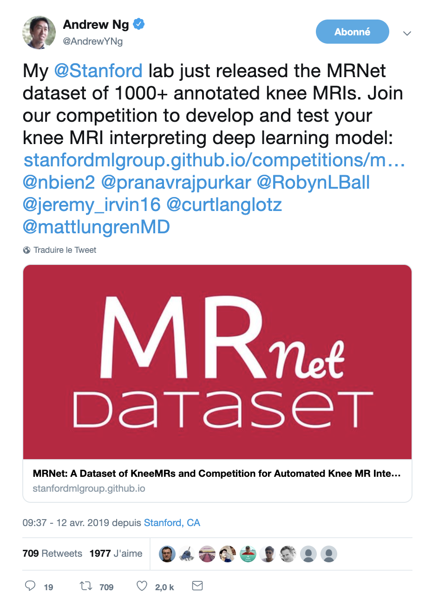

Title: Automate the diagnosis of Knee Injuries with Deep Learning part 1: an overview of the MRNet Dataset 
Date: 2019-06-25 12:00
Category: Medical Imaging
Tags: MRI, Medical Imaging, Computer Vision, MRNet, Convolutional Neural Networks, PyTorch, image classification, Jupyter Widgets
Authors: Ahmed Besbes
Summary:If you are interested in learning an **impactful medical application** of artificial intelligence, this series of articles is the one you should looking at.  My goal is to show you how you can use deep learning and computer vision to assist radiologists in automatically diagnosing severe **knee injuries from MRI scans**.   To do this, we'll first explore the MRNet dataset in this first post. We'll then build a deep learning classification model in PyTorch in the next post and develop an interpretation pipeline in the last one.  By the end, you'll have an overview of a medical imaging application with different components that you can use elsewhere in similar situations. Let's start.  <blockquote class="twitter-tweet tw-align-center" data-lang="fr">
My <a href="https://twitter.com/Stanford?ref_src=twsrc%5Etfw">@Stanford</a> lab just released the MRNet dataset of 1000+ annotated knee MRIs. Join our competition to develop and test your knee MRI interpreting deep learning model: <a href="https://t.co/1OwfEQuTsY">https://t.co/1OwfEQuTsY</a> <a href="https://twitter.com/nbien2?ref_src=twsrc%5Etfw">@nbien2</a> <a href="https://twitter.com/pranavrajpurkar?ref_src=twsrc%5Etfw">@pranavrajpurkar</a> <a href="https://twitter.com/RobynLBall?ref_src=twsrc%5Etfw">@RobynLBall</a> <a href="https://twitter.com/jeremy_irvin16?ref_src=twsrc%5Etfw">@jeremy_irvin16</a> <a href="https://twitter.com/curtlanglotz?ref_src=twsrc%5Etfw">@curtlanglotz</a> <a href="https://twitter.com/mattlungrenMD?ref_src=twsrc%5Etfw">@mattlungrenMD</a>
&mdash; Andrew Ng (@AndrewYNg) <a href="https://twitter.com/AndrewYNg/status/1116742082758991872?ref_src=twsrc%5Etfw">12 avril 2019</a></blockquote>

<!-- 

 -->



