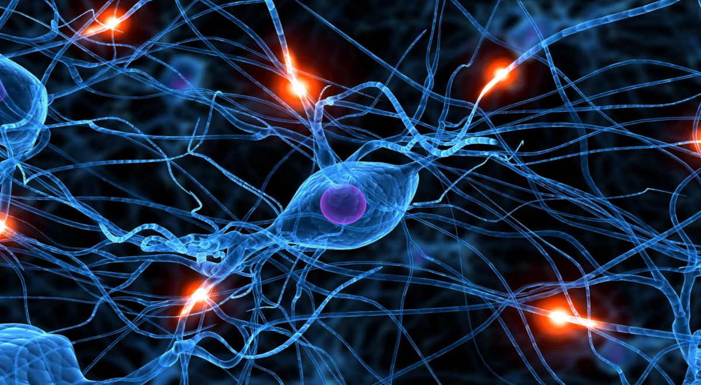

Title: Understanding deep Convolutional Neural Networks with a practical use-case in Tensorflow and Keras
Date: 2017-11-13 12:00
Category: Deep Learning
Tags: Deep learning, Convolutional Neural Networks, image classification, Keras, Tensorflow, AWS, GPU, Python, Kaggle
Authors: Ahmed Besbes
Summary:
<a href="https://www.kdnuggets.com/2017/11/understanding-deep-convolutional-neural-networks-tensorflow-keras.html"></img></a>
Convolutional Neural Networks (CNNs) are nowadays the standard go-to technology when it comes to analyzing image data. These are special neural network architectures that perform extremely well on image classification. They are widely used in the computer vision industry and are shipped in different products: self driving cars, photo tagging systems, face detection security cameras, etc.   The theory behind convnets is beautiful. It attempts to explain and reverse-engineer the vision process. In this article, I'll go through it and explain what CNNs are all about. I'll try to go over the hype you see on the mass media and provide a detailed explanation with code snippets and interpretations. This is also a hands-on guide to setup a deep learning dedicated machine on AWS and develop an end-to-end CNN model from scratch using Keras and Tensorflow. By the end of this post you should have the global picture about CNNs: How do they work? and How to put them in practice?    <a href="https://ahmedbesbes.com/understanding-deep-convolutional-neural-networks-with-a-practical-use-case-in-tensorflow-and-keras.html"></img></a>

<a href="https://www.kdnuggets.com/2017/11/understanding-deep-convolutional-neural-networks-tensorflow-keras.html"></img></a>

*Post featured on <a href="https://www.kdnuggets.com/2017/11/understanding-deep-convolutional-neural-networks-tensorflow-keras.html">KDDnuggets.com</a>.*


