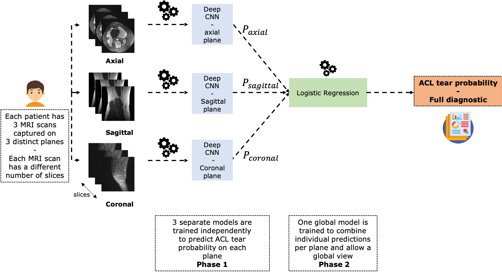

Title: Automate the diagnosis of Knee Injuries with Deep Learning part 2: Building an ACL tear classifier 
Date: 2019-07-14 17:04
Category: Computer vision, Deep Learning
Tags: MRI, Medical Imaging, MRNet, CNN, PyTorch, image classification
Authors: Ahmed Besbes
Summary: In this post, you'll build up on the intuitions you gathered on MRNet data by following the previous post. You'll learn how to use PyTorch to train an ACL tear classifier that sucessfully detects these injuries from MRIs with a very high performance. We'll dive into the code and we'll go through various tips and tricks ranging from transfer learning to data augmentation, stacking and handling medical images. You'll also learn about optimization tricks as well as how to organize your code efficiently. If you're a crafty AI engineer who wants to play with code to learn how things work, just keep reading !   

