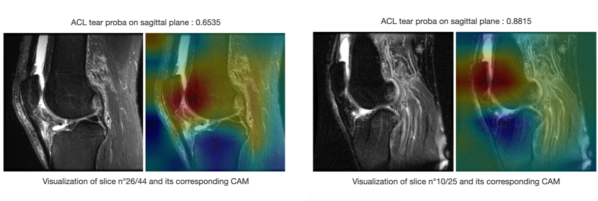

Title: Automate the diagnosis of Knee Injuries with Deep Learning part 3: Interpret models' predictions
Date: 2019-08-21 12:00
Category: Computer vision, Deep Learning, Interpretability
Tags: MRI, Medical Imaging, MRNet, CNN, PyTorch, interpretability, Class Activation Map, CAM
Authors: Ahmed Besbes
Summary: In this post, we will focus on interpretability to assess what the ACL tear detector we trained in the previous <a href="https://ahmedbesbes.com/automate-the-diagnosis-of-knee-injuries-with-deep-learning-part-2-building-an-acl-tear-classifier.html">article</a> actually learnt.  To do this, we'll explore a popular interpretability technique called Class Activation Map, applied when using convolutional neural networks that have a special architecture. By using this method, we'll highlight discriminative areas the network focus on before making a prediction when confronted with an image thus explaining the decision process and building trust.  CAM is also a generic method that can be applied to a variety of computer vision projects. So if you're looking for a way to make your CNNs interpretable you should read this tutorial and adapt the source code. Let's get started. 



<iframe width="100%" height="400" src="https://www.youtube.com/embed/4eyUReyIPXg" frameborder="0" allow="accelerometer; autoplay; encrypted-media; gyroscope; picture-in-picture" allowfullscreen></iframe>



Here's a quick video demo of the dash application:   

<iframe width="100%" height="400" src="https://www.youtube.com/embed/SbNGj51kW28" frameborder="0" allow="accelerometer; autoplay; encrypted-media; gyroscope; picture-in-picture" allowfullscreen></iframe>